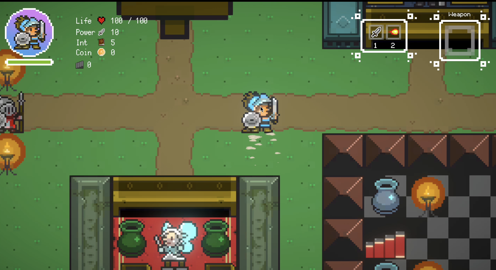
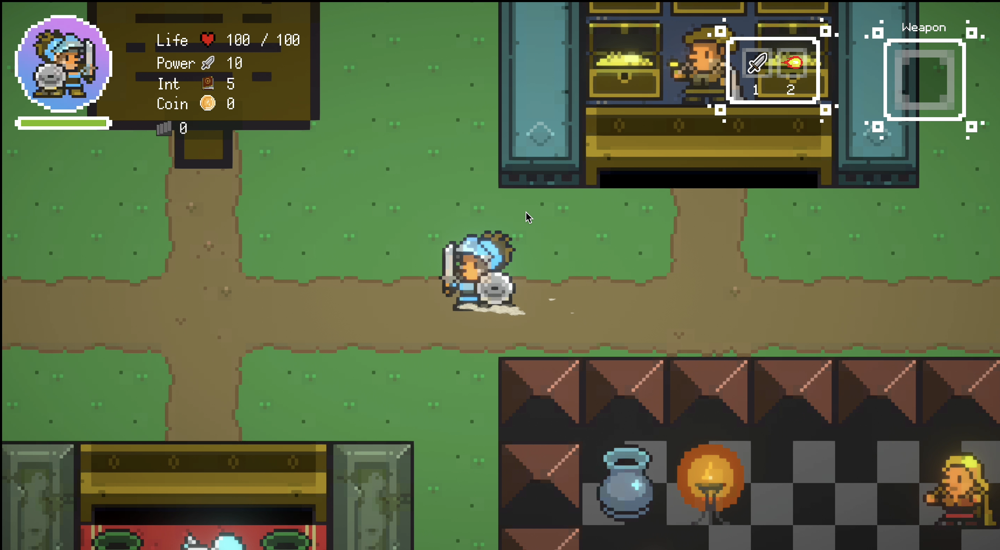
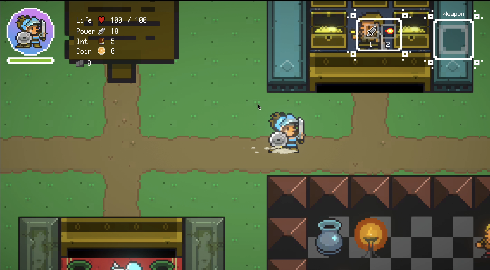
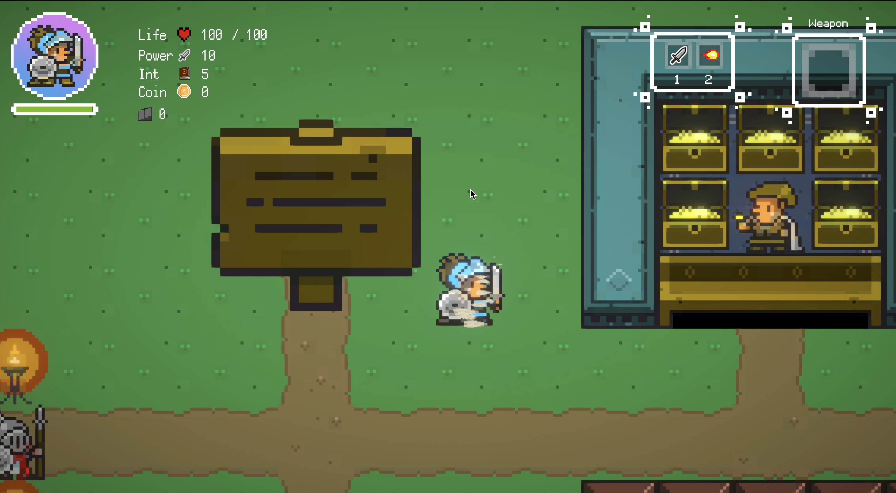
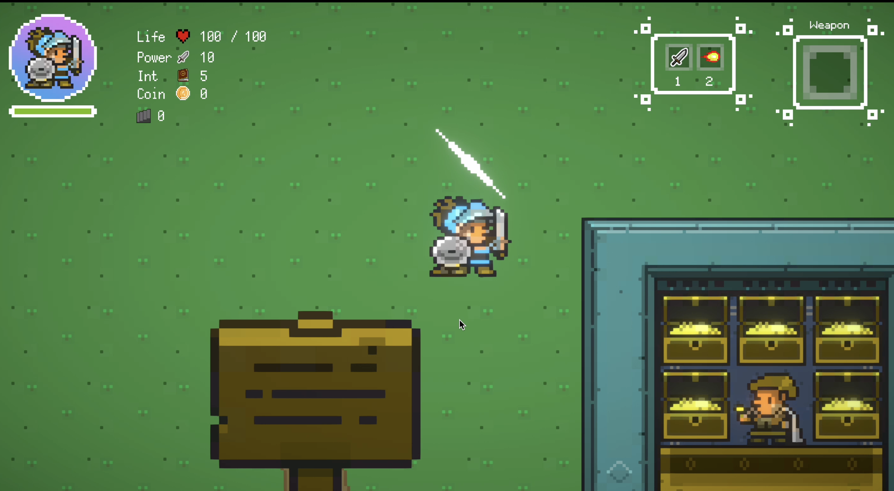
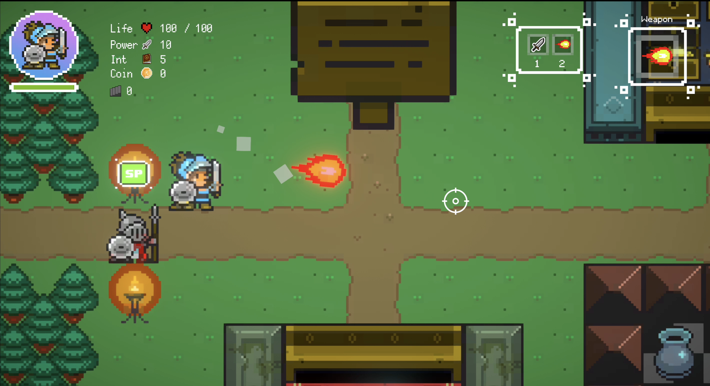
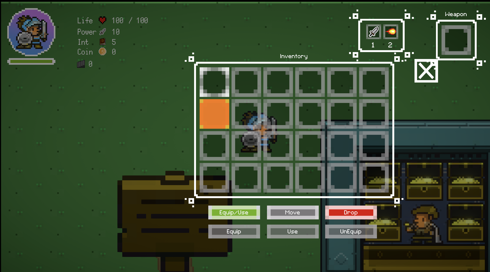
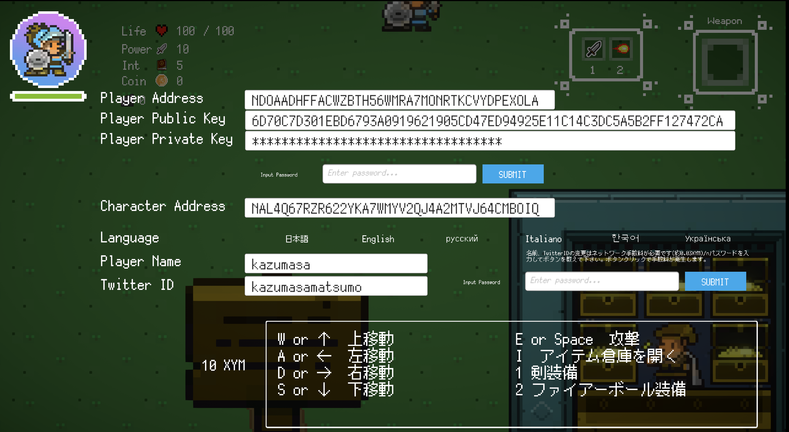
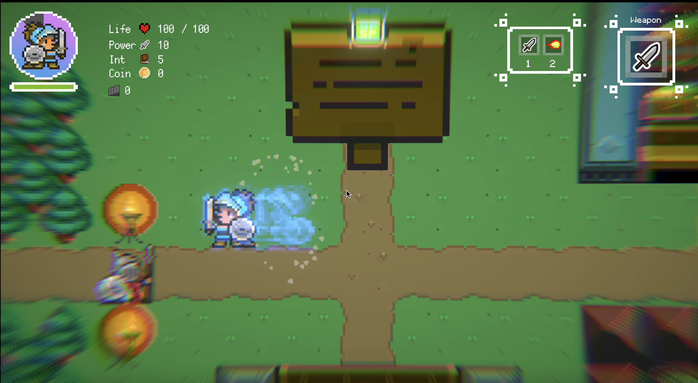
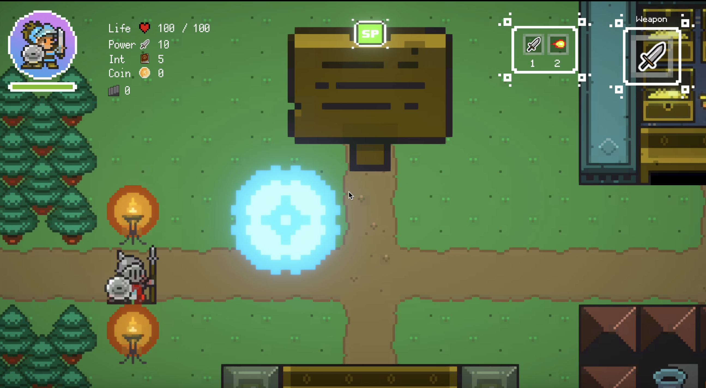

# キーボードとアクションの関係性

ここではキーボードとアクションについて解説します。

対象キー | 動作
-------- | --------
W or ↑ |　上移動
A or ← |　左移動
D or → |　右移動
S or ↓ |　下移動
E or Space |　攻撃
I |　アイテム倉庫を開く
1 | 剣装備
2 | ファイアーボール装備
esc | 設定画面
F | ダッシュ
R | パリィ

## 移動

対象キー | 動作
-------- | --------
W or ↑ |上移動
A or ← |左移動
D or → |右移動
S or ↓ |下移動

上移動

左移動

右移動

下移動

## 攻撃

対象キー | 動作
-------- | --------
E or Space |攻撃

剣を装備した時

ファイアボールを装備した時

## アイテム倉庫を開く

対象キー | 動作
-------- | --------
I |アイテム倉庫を開く

## 装備切り替え

対象キー | 動作
-------- | --------
1 | 剣装備
2 | ファイアーボール装備

剣を装備する（左上のアイコンをチェック）

ファイアーボールを装備する（左上のアイコンをチェック）

## メニュー

対象キー | 動作
-------- | --------
esc | 設定画面

## 特殊アクション

対象キー | 動作
-------- | --------
F | ダッシュ
R | パリィ

ダッシュ

パリィ
