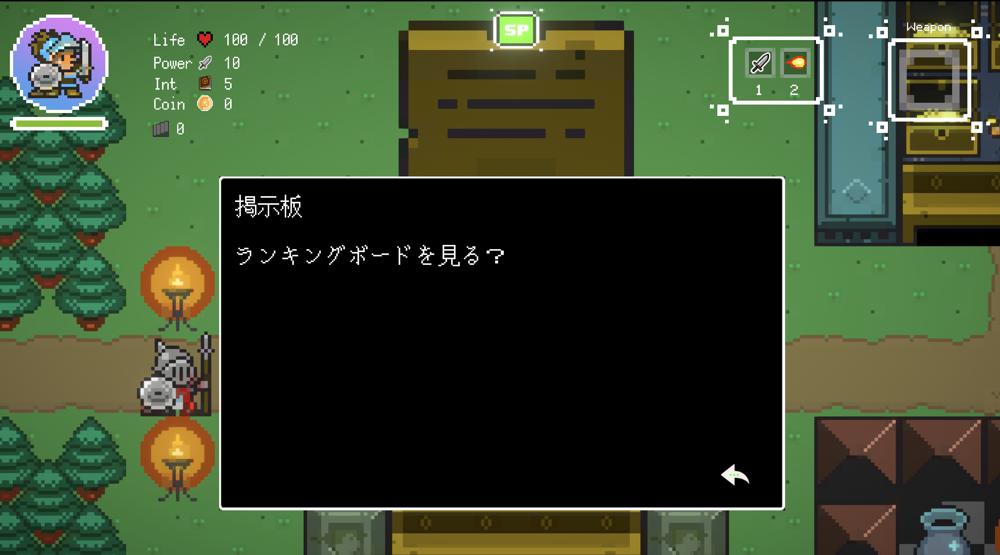
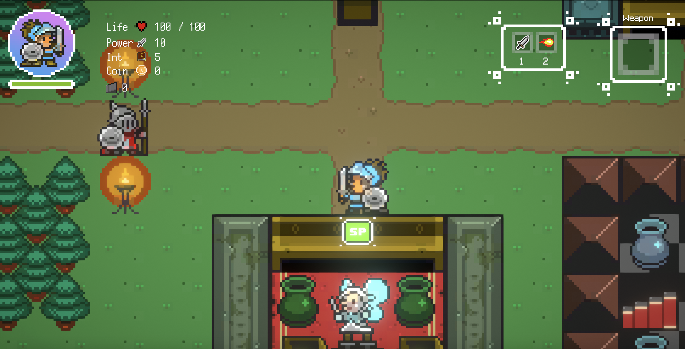
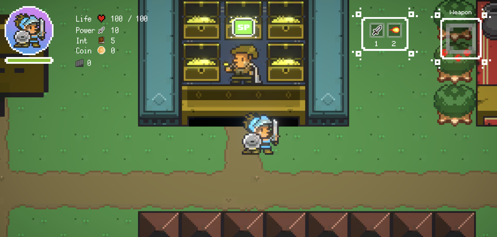
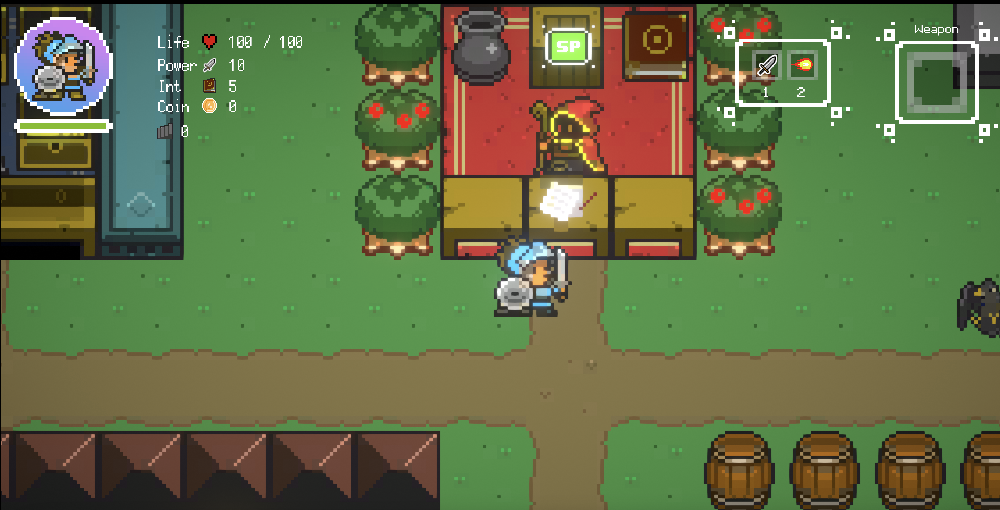

# 城下町のキャラクターとできること

## SPマーク

SPマークはスペースキーを押すと何かしら行動できるマークです

## ランキングボード

プレイヤーのランキングボードが見れます。（ランキングは階層になります）

プレイヤーの記録も見ることができる

## 城の騎士

ゲームの説明役

## 宝石屋ジュエル

道中で獲得した小石を装備品に変えてくれる人

## 交換屋ゴザイフ

道中で獲得したコインをジェムに変える

ジェムをコインに変える（ゲームオーバー時に役立ちます）

## 美術館支配人

美術館の説明役

左の階段に入ると

COMSAやNFT DRIVEのアドレスを入力してモザイクのギャラリーになる

## 賭博屋カイジム

一日1回無料ルーレット

コインや小石がもらえる

## 育て師ネム

コインを払ってパラメータアップ（1XYM必要）

## 運び屋バード

クリアした階であれば好きなところへ行ける（1XYM必要）

## 塔の入り口

ダンジョンの入り口（1階から）

