# ダンジョン内解説

ダンジョン内には色々なものがあります

## トラップ

ダメージを受ける床です

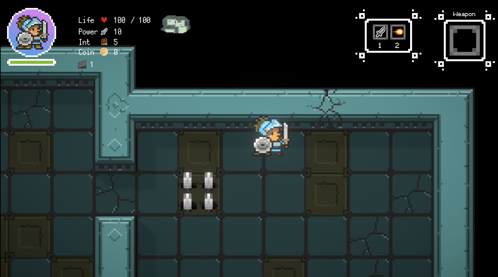

## アイテム

アイテムは接触すると拾えます

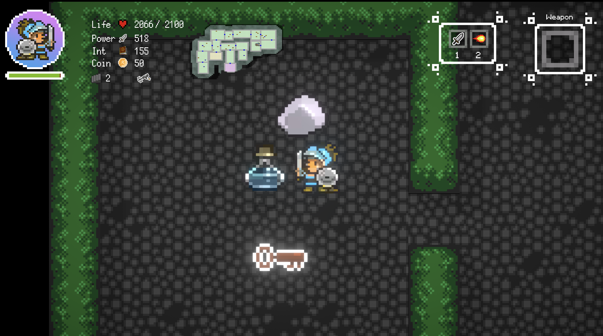

## ステータスは左上で確認できます

ステータス

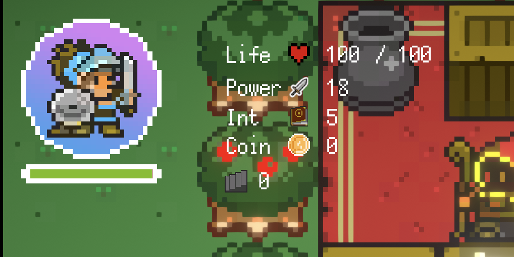

チーター

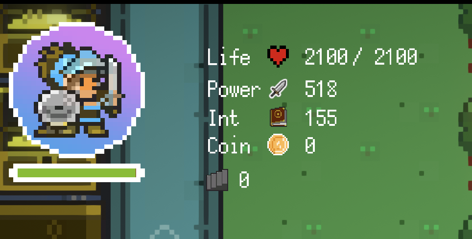

## 階段前の扉

階段前の扉はこの扉です。

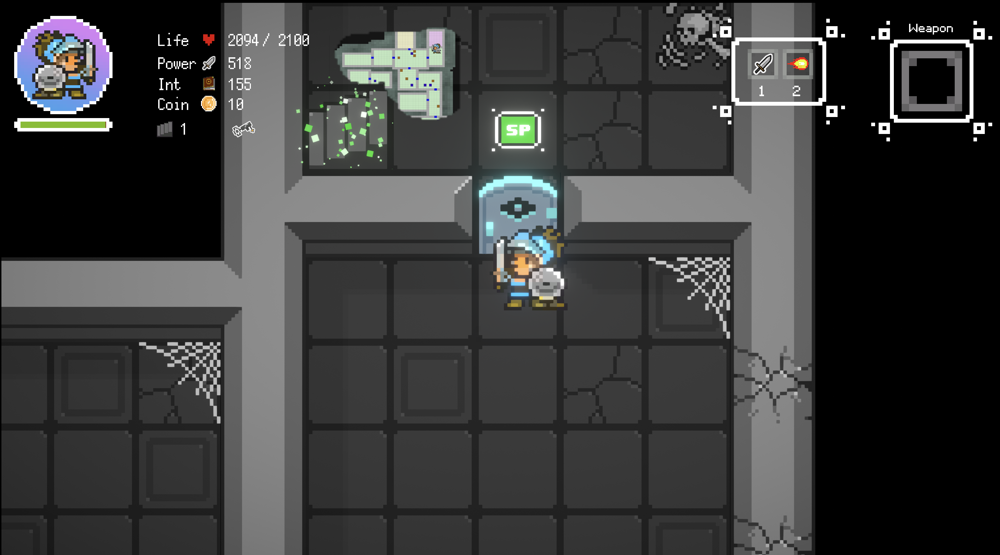

## 階段

階段で上の階にいきます

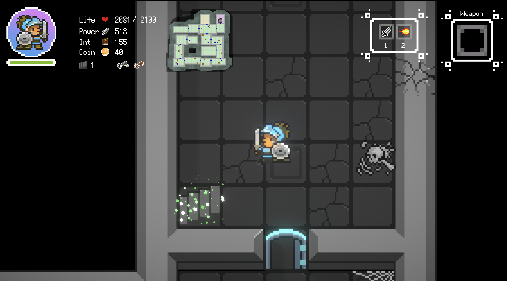

## 宝物庫の鍵

宝物庫には鍵が必要です

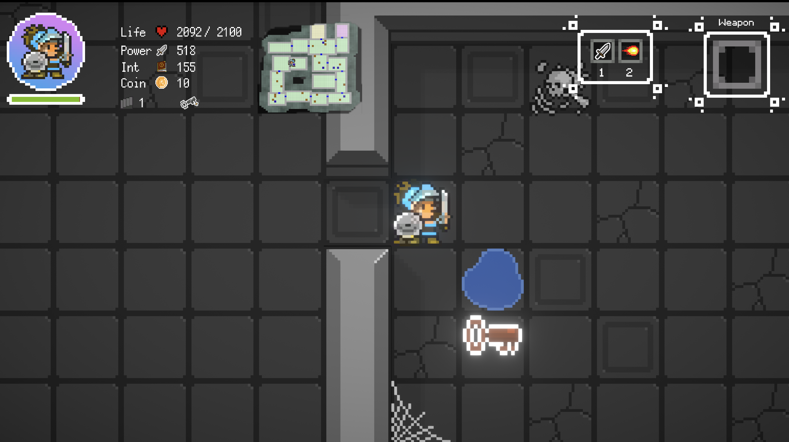

## 宝物庫の扉

宝物庫の扉はこの扉です

扉は近くまで行ってスペースキーを押すと開きます。（鍵を持っていないと開きません）

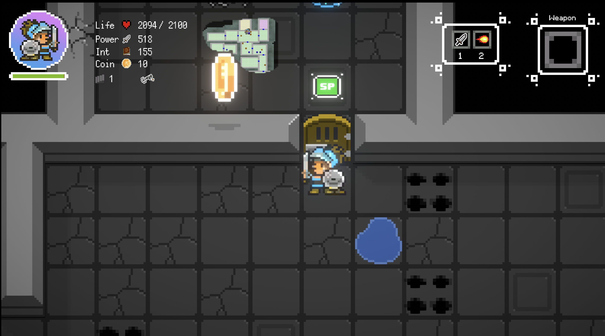

## 脱出口

脱出口はこちらです

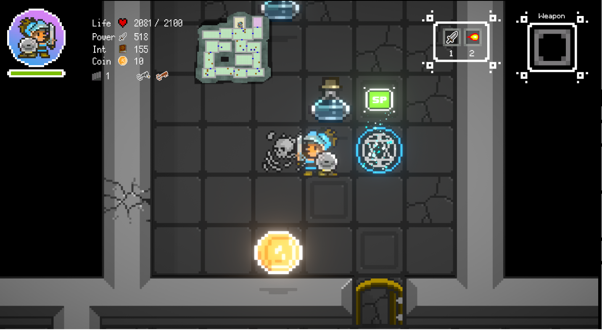

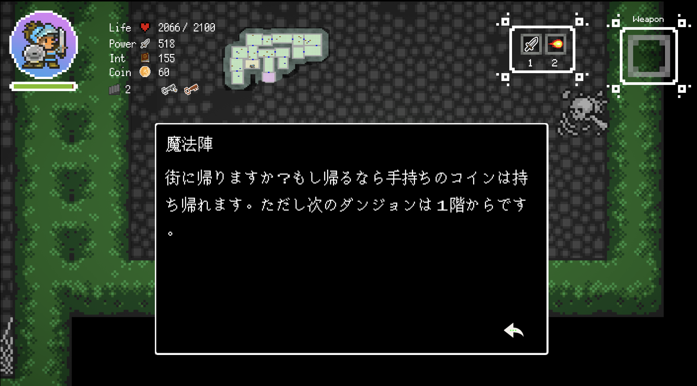

## ゲームオーバー

ゲームオーバーになると獲得したコインは失います。また城下町に戻ります。

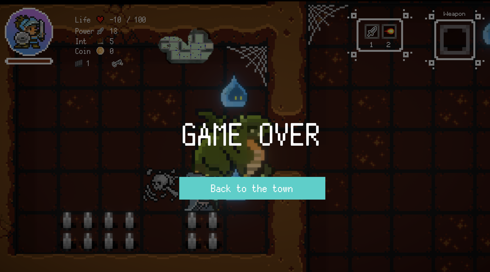