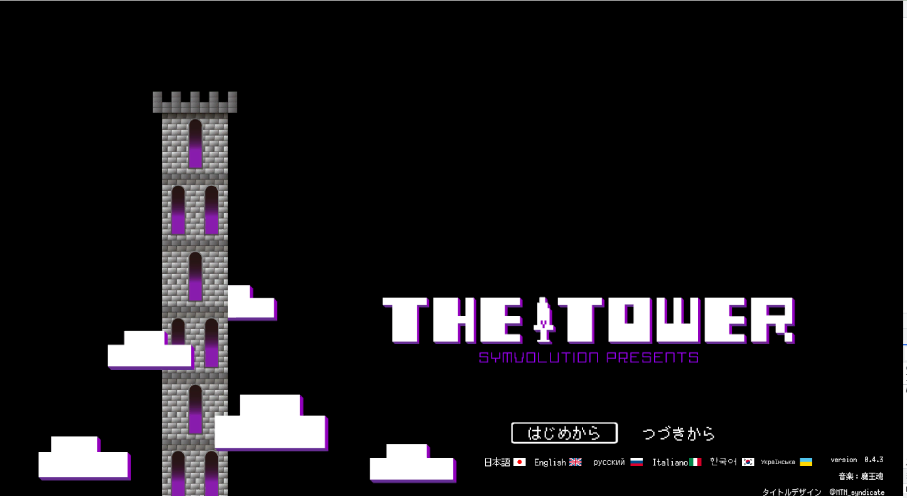
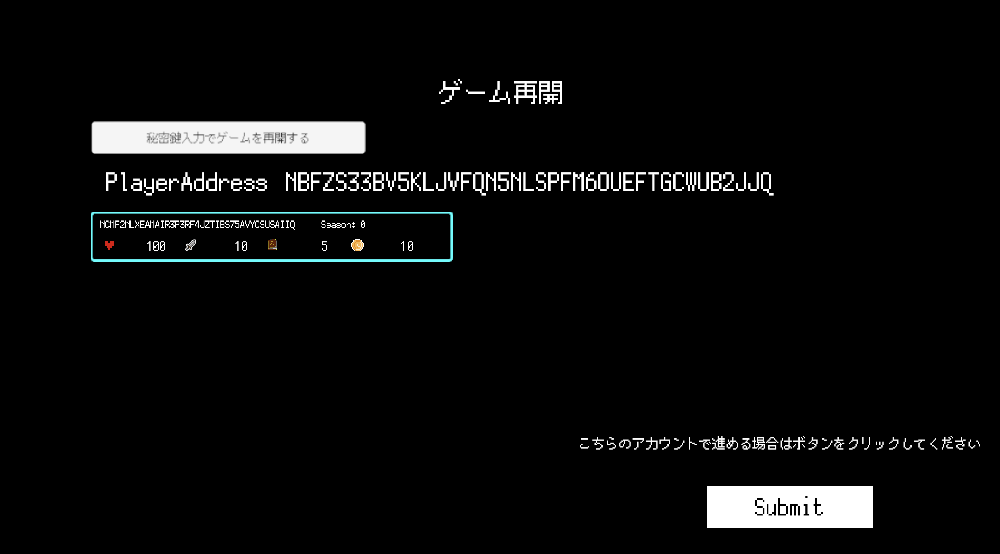
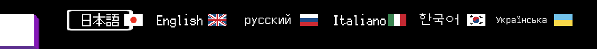

# トップページ

まずはURLへアクセスします

[URLはこちら](https://symvolution.com/thetower/)

ページにアクセスすると

「はじめから」と「つづきから」を選ぶことができます。

## はじめから

「はじめから」を選択するとパスワード入力の画面になります。

## つづきから

「つづきから」を選択すると現在選択されているアカウントの画面になります。

## 言語設定

言語は

- 日本語
- 英語
- ロシア語
- イタリア語
- 韓国語
- ウクライナ語

が選ぶことができます。

