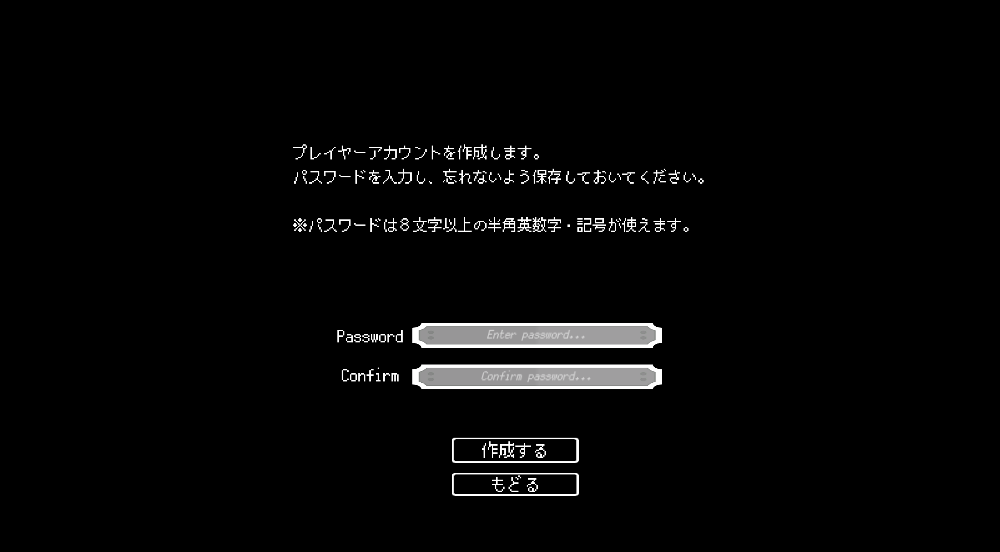
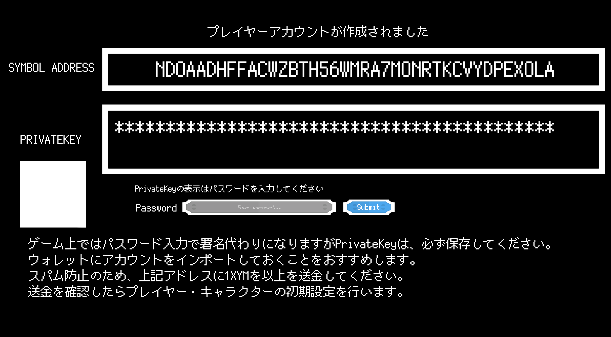
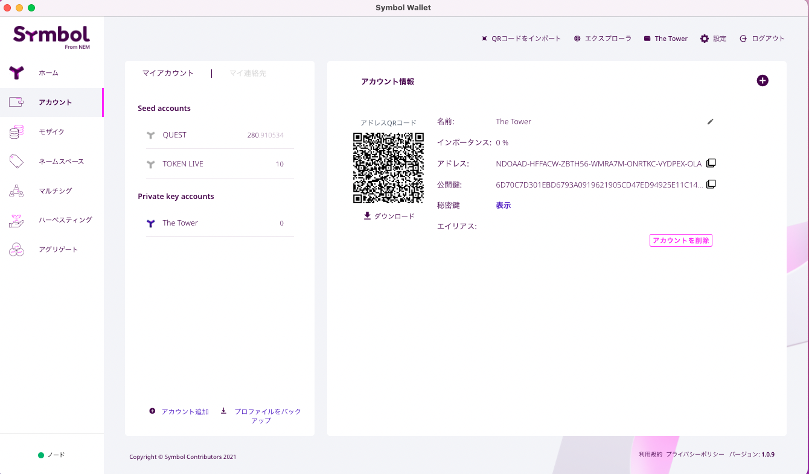
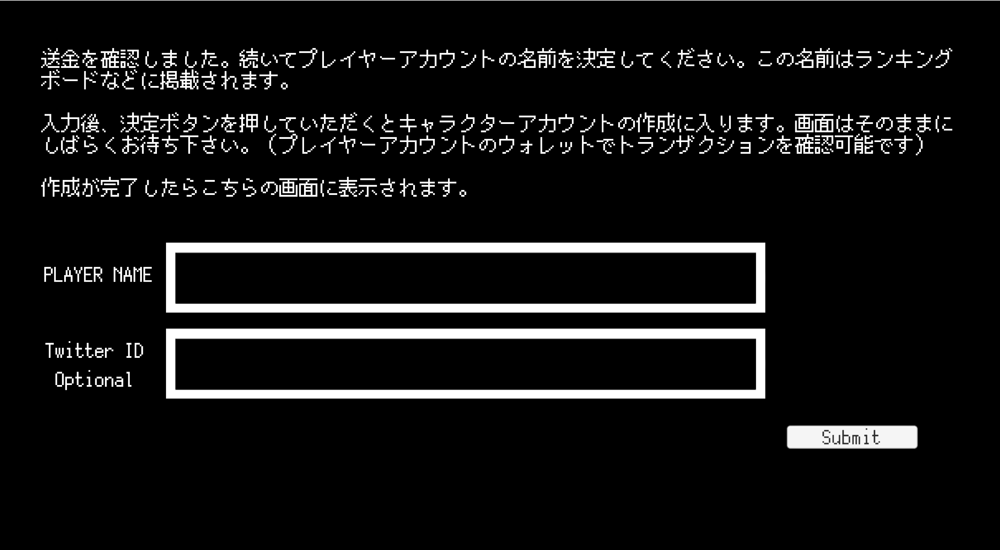
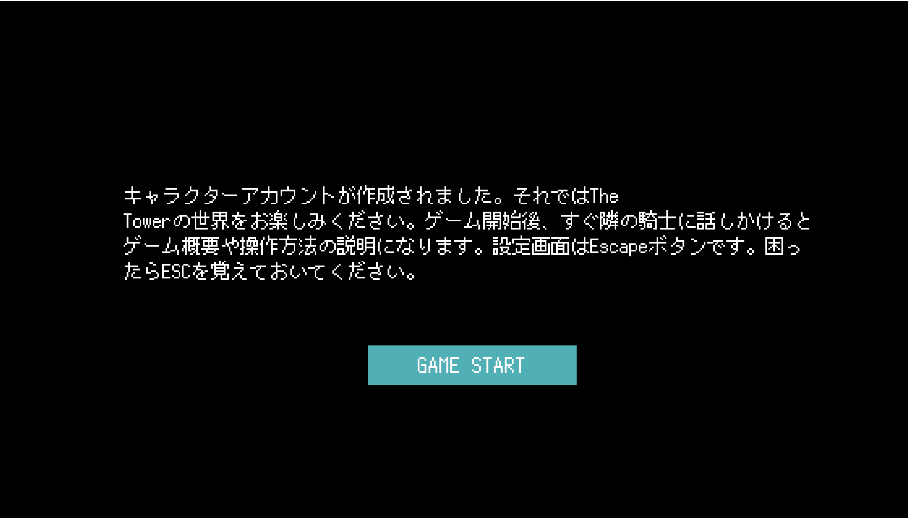

# はじめからゲームをする

ここでは「はじめから」を選択した場合の流れを見ていきます。

パスワードの入力が完了すると

プレイヤーアカウントの画面になります。

秘密鍵はどこかに保存しておく必要があります。

この秘密鍵はデスクトップウォレットで復元しておきましょう。
（バックアップの一つとして）

紙に書くのもありですが、保存形式は自己責任になります。

アカウントの復元ができましたので、

このアドレスに対して1xymを送金します。

送金が確認できると、プレイヤーの名前の入力とTwitterのアカウントIDを入力できます。

名前を入力してSubmitを押すとトランザクションが発生します。

[アグリゲートトランザクション](https://symbol.fyi/transactions/64052C0631AE91EB749922677DE27B8FAD801D8F9A263EE551539EC5D669C5CB)

内容は気にしなくていいです。

アカウントを作成するにあたって、必要なことです。

さてそれではゲームを始めよう。